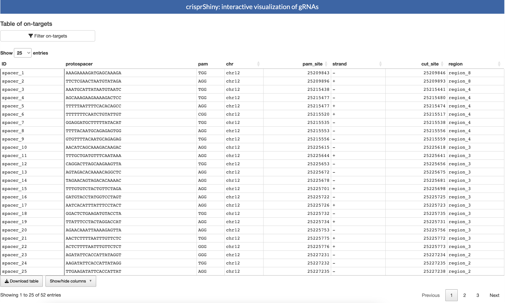
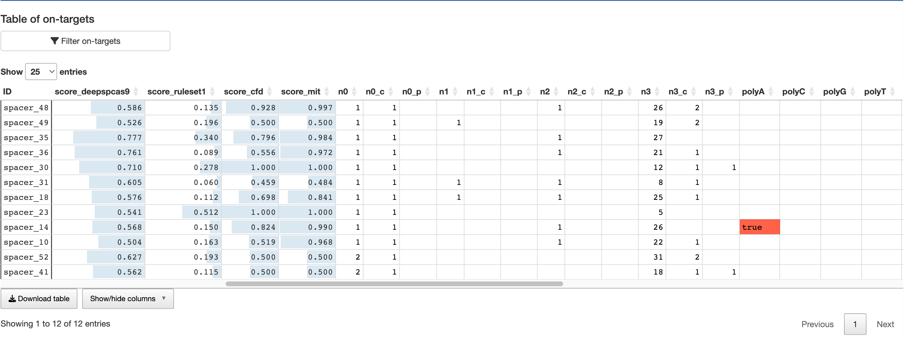
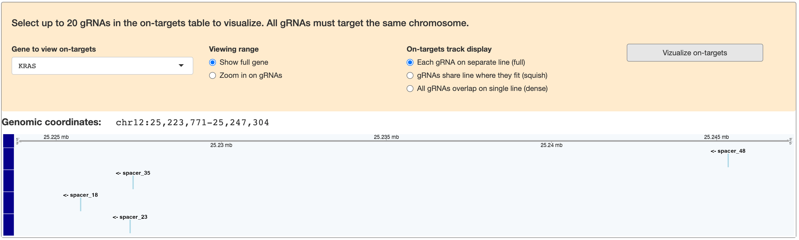
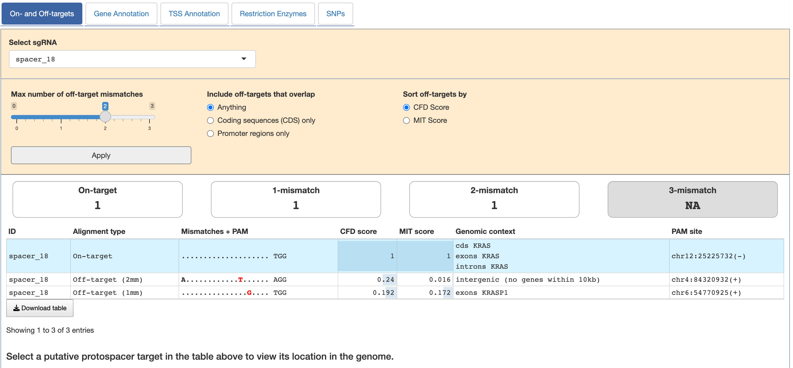

# Introduction

The `crisprShiny` package allows users to interact with and visualize 
CRISPR guide RNAs (gRNAs) stored in `GuideSet` objects via Shiny applications.
This is possible either directly with a self-contained app, or as a module
within a larger app. This vignette will demonstrate how to use this package to
build Shiny applications for `GuideSet` objects, and how to navigate gRNA
annotation within the app.

Shiny apps created using the `crisprShiny` package require `GuideSet` objects
be constructed and annotated using the `crisprDesign` package, however, custom
`mcols` may be added to the `GuideSet`, as shown below. For more information
about how to store and annotate CRISPR gRNAs with `GuideSet` objects, see our
[crisprVerse tutorials page](https://github.com/crisprVerse/Tutorials).


# Installation

`crisprShiny` can be installed from from the Bioconductor devel branch
using the following commands in a fresh R session:

```{r, eval=FALSE}
if (!require("BiocManager", quietly = TRUE))
    install.packages("BiocManager")
BiocManager::install("crisprShiny", version="devel")
```


# Creating self-contained Shiny applications

## Basic GuideSet (no additional annotations)

The `GuideSet` object can include a great variety of gRNA annotation (see
`crisprDesign` package) that can be neatly displayed in a Shiny app by simply
passing it to the `crisprShiny` function. This function dynamically renders
components to display annotations that are present in the `GuideSet`. To
demonstrate, let's first use it with a precomputed, non-annotated `GuideSet`
of gRNAs targeting the CDS of the human KRAS gene, which is stored in the
`crisprShiny` package. Note that the `crisprShiny` function returns an app
object, which can then be run using `shiny::runApp`.

```{r}
if (interactive()){
    library(crisprShiny)
    data("guideSetExample_basic", package="crisprShiny")
    app <- crisprShiny(guideSetExample_basic)
    shiny::runApp(app)
}
```



Passing this `GuideSet` returns a simple data table and a button to set
filtering criteria. The columns in the **Table of On-targets** reflect the
mcols present in the `GuideSet` (with an exception for certain list-column
annotations, such as `alignments`, shown below). We can add columns to the
`mcols` of the `GuideSet`, which then appear in the data table. (Note: adding
columns that share names with annotations added by functions in the
`crisprDesign` package can result in unexpected behaviors, and is therefore
not advised.)

```{r}
if (interactive()){
    gs <- guideSetExample_basic[1:50]
    
    ## add custom data columns
    library <- c("lib1", "lib2", "lib3", "lib4")
    set.seed(1000)
    values <- round(rnorm(length(gs)), 4)
    mcols(gs)[["values"]] <- values
    library <- sample(library, length(gs), replace=TRUE)
    mcols(gs)[["library"]] <- library
    
    ## create and run app
    app <- crisprShiny(gs, geneModel=txdb_human)
    shiny::runApp(app)
}
```


## Fully-annotated GuideSet

For a more interesting app, we can pass a `GuideSet` containing gRNA
annotations to the `crisprShiny` function. This will include additional
components for each in-depth gRNA-level annotation, such as alignments, and
gene annotation. For our example we will use a fully-annotated version of the
`GuideSet` used above.

```{r}
if (interactive()){
    data("guideSetExample_kras", package="crisprShiny")
    app <- crisprShiny(guideSetExample_kras)
    shiny::runApp(app)
}
```

Passing a fully-annotated `GuideSet` to the `crisprShiny` function creates what
can be thought of as a "fully-functional" app, in that all annotation features
are presented in the app. Each are described in the following sections.


### On-targets table

All `mcols` in the `GuideSet` that are not list-columns (`alignments`, etc.)
are shown in this table, with `ID`, (names of the `GuideSet`) given in the
first column. Some columns added by `crisprDesign` functions (see
`crisprDesign` package) have special formatting:

- **scores** (columns prefixed by `score_` and supported by the `crisprScore`
package) have blue bars that allow for quick comparison across gRNAs.
- **alignment summary** (`n0`, `n1_c`, etc.) are blank for values of `0`, and
grayed out for `NA` values (see `?crisprDesign::addSpacerAlignments`).
- many flag columns (having `TRUE` or `FALSE` values, such as `inRepeats` and
`polyT`) are highlighted when the flag is present and blank otherwise, to
quickly identify potentially problematic gRNA features.



There are several ways to interact with these data in the table:

- the data can be sorted on most columns by clicking on the column header.
- above the table is a button that displays filtering options (see [gRNA
filters]) and a dropdown menu controlling the number of gRNAs to display per
datatable page.
- below the table are options to download the on-targets table (only visible
columns), and to control which columns are visible.
- each row, which corresponds to unique gRNAs, can be selected and is used as
input for the visualization component (see [Visualizing on-targets]).


### gRNA filters

Clicking on the **`r shiny::icon("filter")`Filter on-targets** button opens the
menu to filter gRNAs in the on-targets table. Filters options depend on which
annotations are present in the `GuideSet` object (see `crisprDesign` package
for information on annotations), and are divided into separate gRNA-feature
categories, as described in the following sections. The default filter values
can be controlled with the `useFilterPresets` argument of the `crisprShiny`
function (see `?crisprShiny` for details).


#### Nucleotide content {-}

This covers nucleotide-specific features, including

- whether gRNAs contain polyT sequences (four or more consecutive T bases)
- percent GC content of the gRNA sequence
- whether the protospacer is adjacent to a canonical PAM in the target DNA


#### Off-target count {-}

These filters set the upper limits for number of on- and off-targets in the
host genome. Limits can be set for each off-target by mismatch count and
whether the off-target occurs in a gene CDS or promoter region. The `GuideSet`
must have alignment annotation for this section to be available.


#### Scores {-}

This section sets the lower limits for on- and off-target scores, as well as
options for permitting `NA` scores (such as with non-targeting control
sequences). See the `crisprScores` package for available scoring methods.


#### Genomic Features {-}

This section concerns the genomic context of protospacers: whether they overlap
repeat elements, SNPs, or Pfam domains.


#### Isoform-specific parameters {-}

This section allows for narrowing gRNAs to those targeting specific isoforms,
a defined region within that isoform, and a minimum percent of isoform coverage
for the target gene.


#### Promoter targeting parameters {-}

This section filters for gRNAs that target, and are within a certain distance
from, a specific TSS.


### Visualizing on-targets

As stated in component, the user may select up to 20 gRNAs from same chromosome
in the table of on-targets to plot using the `crisprViz` package. In this
example, no value was passed to the `geneModel` argument, so no gene
information is available for the plot. If we rerun the function with a
`GRangesList` (see `crisprDesign` package), such as `txdb_human` from the
`crisprDesignData` package, the gene transcripts are also plotted. There are
additional options to set the viewing range and how the gRNA track is organized.



Regardless of what value is passed to `geneModel`, this component is only
available if the `GuideSet` is annotated with `gene_symbol` and/or `gene_id`
column(s) in `mcols`.


### gRNA-specific anntations/list columns

Additonal interactive components for detailed annotations present in the
`GuideSet` can be found at the bottom of the app. Annotations are presented one
gRNA at a time, selected using the dropdown menu, and are described below.


#### On- and Off-targets {-}



This tab presents information about each on- and off-target. The putative
protospacers can be filtered by maximum number of mismatches, target genomic
context, and whether they are adjacent to canonical PAMs, as well as sorted by
CFD or MIT score (SpCas9 only).


Just below the filters is a quick summary of the on- and off-target count for
the gRNA, and details about each putative protospacer in a datatable, such as
where mismatches occur, off-target scores, and its genomic location with
gene-level context. Rows in the datatable can be selected to visualize the
protospacer target with respect to the target or nearby gene (up to 10kb).


#### Gene Annotation {-}

Currently, this tab displays a datatable of gene annotation for the selected
gRNA, identical to the output of `crisprShiny::geneAnnotation(guideSet)`.


#### TSS Annotation {-}

Currently, this tab displays a datatable of TSS annotation for the selected
gRNA, identical to the output of `crisprShiny::tssAnnotation(guideSet)`.


#### Restriction Enzyme {-}

This tab includes a datatable of restriction enzymes whose motifs are found in
the gRNA. Restriction enzymes in the table and gRNA flanking sequences used to
determine presence of motifs depend on arguments passed to
`crisprDesign::addRestrictionEnzymes` in constructing the input `GuideSet`.

<!-- can the flanking sequences be extracted? -->


#### SNPs {-}

Currently, this tab displays a datatable of SNPs annotation for the selected
gRNA, identical to the output of `crisprShiny::snps(guideSet)`.


<!-- add tab about BE component -->


# Customized apps using Shiny modules

The UI and server components of `crisprShiny` are also available outside of
the `crisprShiny` function to be used as modules within a larger app that, for
instance, may allow the user to parse multiple `GuideSet` objects in a single
session. Below is a simple example that allows the user to explore both the
basic and fully-annotated `GuideSet`s used above in the same session.

```{r}
if (interactive()){
    library(shiny)
    
    ui <- function(id){
        fluidPage(
            sidebarLayout(
                sidebarPanel(
                    selectInput(
                        inputId="guideSet_select",
                        label="Select GuideSet",
                        choices=c("simple", "full")
                    )
                ),
                mainPanel(
                    crisprUI(id)
                )
            )
        )
    }
    
    server <- function(id){
        function(input, output, session){
            guideSet_list <- list("simple"=guideSetExample_basic,
                                  "full"=guideSetExample_kras[1:50])
            gs <- reactive({
                req(input$guideSet_select)
                guideSet_list[[input$guideSet_select]]
            })
            observeEvent(gs(), {
                crisprServer(
                    id,
                    guideSet=gs(),
                    geneModel=txdb_human,
                    useFilterPresets=TRUE
                )
            })
        }
    }
    
    
    myApp <- function(){
        id <- "id"
        shinyApp(ui=ui(id), server=server(id))
    }
    
    myApp()
}
```


# Session Info

```{r eval=TRUE}
sessionInfo()
```
